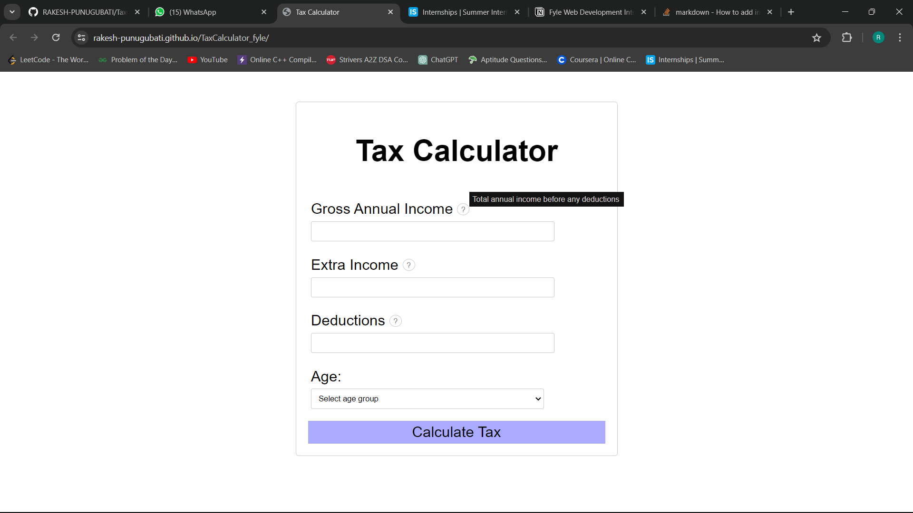
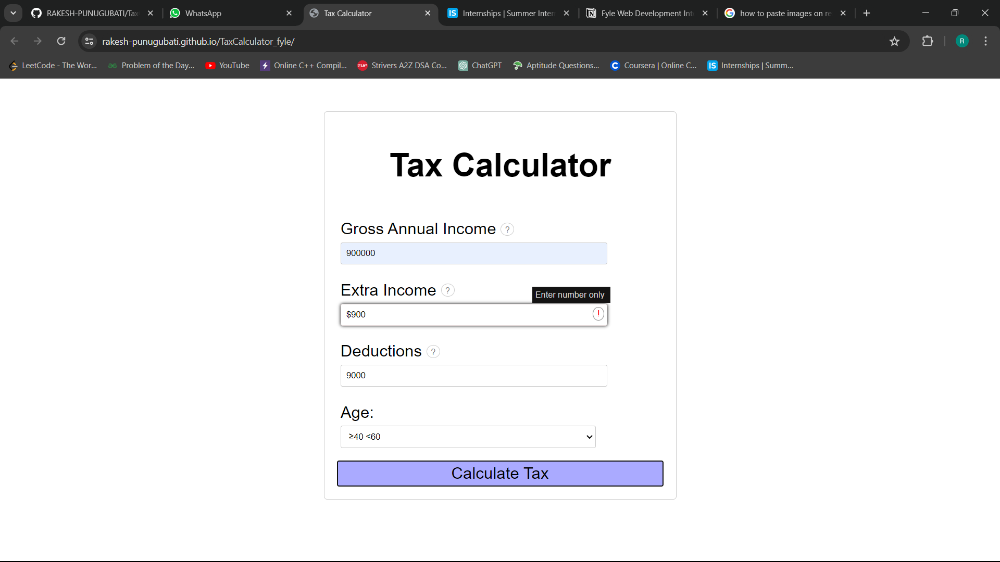
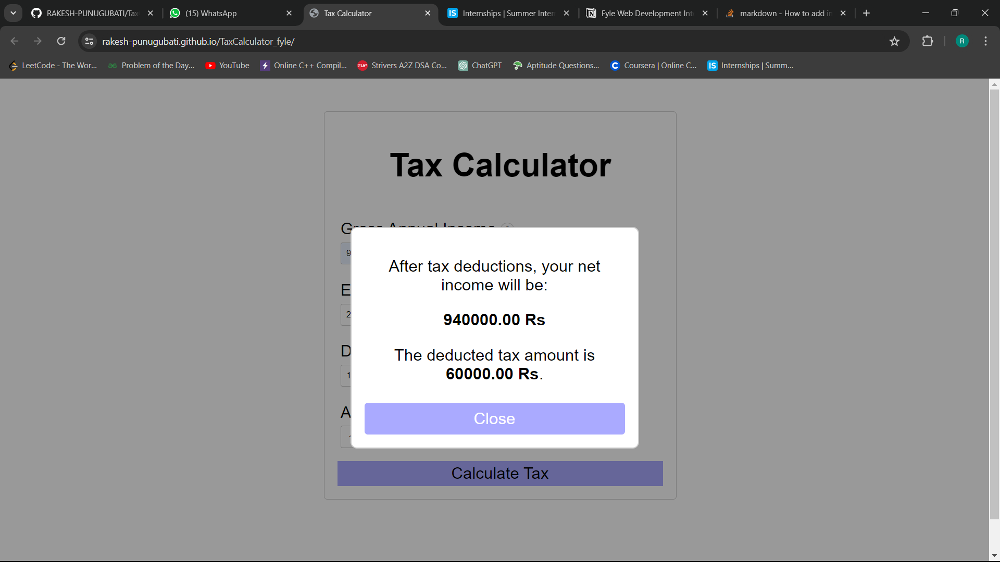
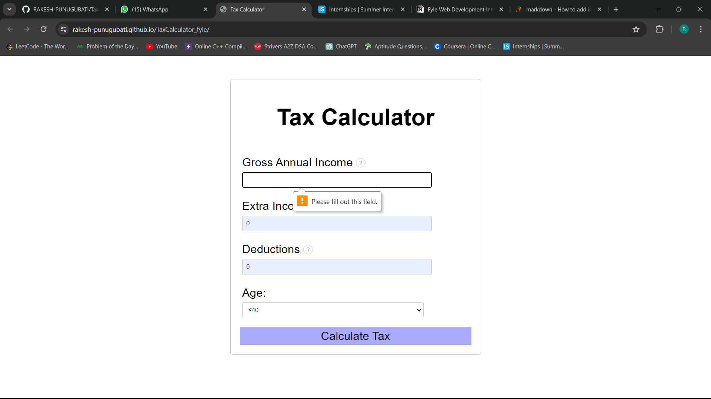
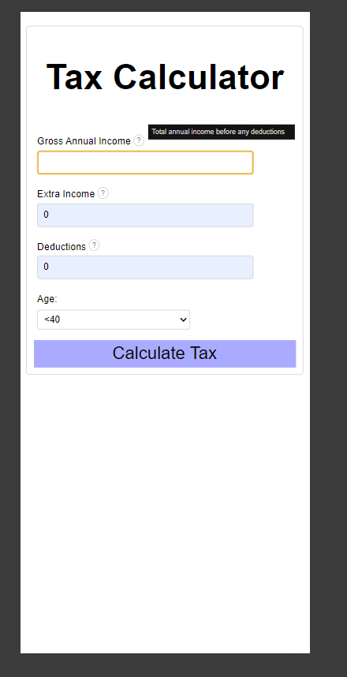
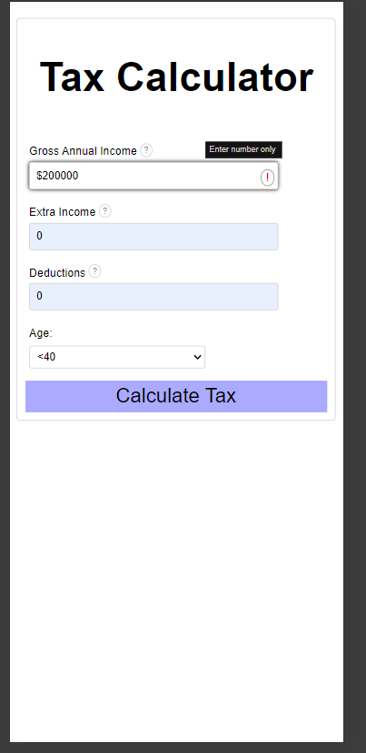

# Tax Calculator

This is a simple web application for calculating taxes based on the user's income, extra income, deductions, and age group.

## Features

- Allows users to input their gross annual income, extra income, deductions, and age group.
- Validates user input to ensure all required fields are filled and input values are valid.
- Calculates tax based on the provided information.
- Displays the net income after tax deductions and the deducted tax amount.
- Responsive design for mobile and desktop devices.
- Provides tooltips for guiding users on input fields.

## Usage

1. Open the [Tax Calculator](https://rakesh-punugubati.github.io/TaxCalculator_fyle/) web application in your web browser.
2. Fill in the required information:
   - Gross Annual Income (in Rs)
   - Extra Income (in Rs)
   - Deductions (in Rs)
   - Age Group
3. Click on the "Calculate Tax" button.
4. View the calculated tax information displayed on the screen.

## Development

To set up the project locally for development:

1. Clone this repository to your local machine.
2. Navigate to the project directory.
3. Open the `index.html` file in your web browser or set up a local server.
4. Make changes to the HTML, CSS, and JavaScript files as needed.
5. Test the application to ensure it functions correctly.
6. Commit your changes and push them to your GitHub repository.

## Test Cases

## Desktop View

## mobile view

